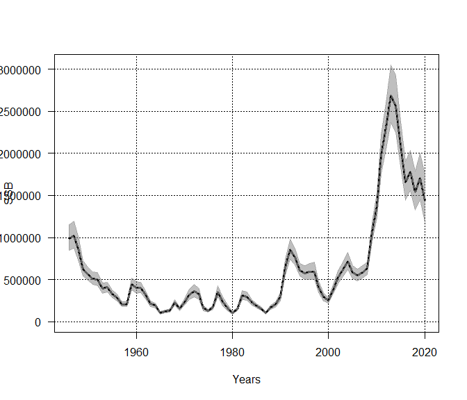
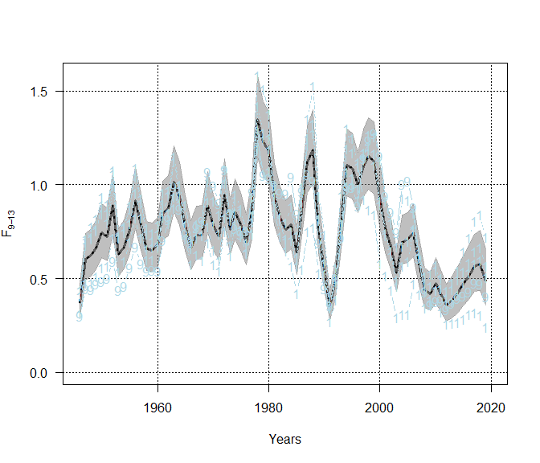
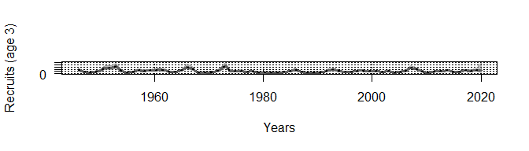
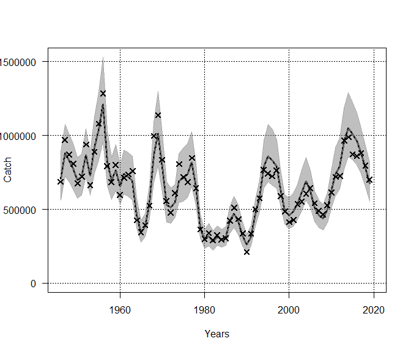
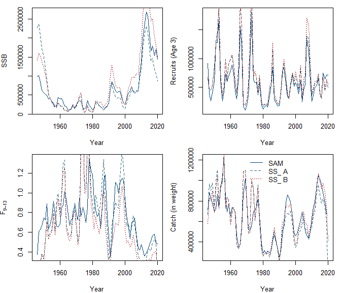

<!-- README.md is generated from README.Rmd. Please edit that file -->

### NOBA Cod SAM2SS conversion

In this example, we convert NOBA Cod State-space assessment model (SAM)
inputs to Stock Synthesis (SS) inputs and compare the outputs from the
two packages.

### Install and library packages

``` r
# install.packages("here")
# 
# install_64bit <- TRUE
# 
# if (install_64bit) {
#   args <- c("--no-multiarch")
# } else {
#   args <- c("")
# }
# 
# devtools::install_github("fishfollower/SAM/stockassessment", INSTALL_opts = args)
# 
# remotes::install_github("r4ss/r4ss", branch = "development")
# 
# remotes::install_github("Bai-Li-NOAA/saconvert") # Need to install "kellijohnson-NOAA/saconvert" after doing pull request.
# 
# remotes::install_github("nmfs-general-modeling-tools/nmfspalette")

library(here)
library(stockassessment) # For using SAM
library(r4ss) # For using SS
library(saconvert)
library(nmfspalette)
```

### Read SAM input data and run SAM

``` r
sam_input_path <- here::here("NOBA_cod_files", "NEAcod-2020", "data")

# Read in data files
regdat <- grep(".dat",list.files(sam_input_path))
filenames_ICES <- list.files(sam_input_path)[regdat]

#All objects are now on input_file_list
input_file_list <- lapply(file.path(sam_input_path,filenames_ICES), read.ices)
names(input_file_list) <- gsub(".dat","",filenames_ICES)

#Load into function environment as objects
list2env(input_file_list, environment())
```

    ## <environment: R_GlobalEnv>

``` r
# Create a collected data object
sam_dat <- setup.sam.data(
  surveys = survey,
  residual.fleet = cn,
  prop.mature = mo,
  stock.mean.weight = sw,
  catch.mean.weight = cw,
  dis.mean.weight = dw,
  land.mean.weight = lw,
  prop.f = pf,
  prop.m = pm,
  natural.mortality = nm,
  land.frac = lf
)

# Generate a default/minimalistic model configuration
sam_conf <- defcon(sam_dat)

# Generate default initial values for all our model parameters
sam_par <- defpar(sam_dat, sam_conf)

# Fit the SAM model
sam_fit <- sam.fit(sam_dat, sam_conf, sam_par, silent=TRUE)
```

    ##   0:     2952.2477: -5.00000 -5.00000 -5.00000 -5.00000 -5.00000 -5.00000 -5.00000 -5.00000 -5.00000 -5.00000 -5.00000 -5.00000 -5.00000 -5.00000 -5.00000 -5.00000 -5.00000 -5.00000 -5.00000 -5.00000 -5.00000 -5.00000 -5.00000 -5.00000 -5.00000 -5.00000 -5.00000 -5.00000 -5.00000 -5.00000 -5.00000 -5.00000 -5.00000 -5.00000 -0.700000 -0.350000 -0.350000 -0.350000 -0.350000 -0.350000 -0.350000 -0.350000 0.500000
    ##   1:     2510.6745: -4.82768 -4.85109 -4.87712 -4.90518 -4.94687 -4.97971 -4.96949 -4.97489 -5.09755 -5.11069 -5.10291 -5.07615 -5.05791 -5.03593 -5.04012 -5.01718 -5.04889 -5.04139 -5.01414 -4.99116 -4.96894 -4.95281 -4.95714 -4.95358 -4.91691 -4.99436 -5.00339 -5.00995 -5.01817 -5.02676 -5.02997 -5.03776 -5.03647 -5.07078 -0.933981 -0.372391 -0.730497 -0.832598 0.207112 -0.0737741 -0.253570 -0.288987 0.616601
    ##   2:     2227.9573: -4.72315 -4.75807 -4.79892 -4.84232 -4.90976 -4.96394 -4.94830 -4.95373 -5.17251 -5.19736 -5.18287 -5.12988 -5.09843 -5.06174 -5.07081 -5.02469 -5.12619 -5.07097 -5.00313 -4.95005 -4.89633 -4.86488 -4.88778 -4.87300 -4.76075 -4.98883 -5.00140 -5.01613 -5.03684 -5.05621 -5.06592 -5.08806 -5.09034 -5.17912 -1.32800 -0.392892 -1.23086 -1.39785 0.0758508 -0.296552 -0.156056 -0.315731 0.866380
    ##   3:     2095.1984: -4.49921 -4.54847 -4.61396 -4.68441 -4.80613 -4.90882 -4.89148 -4.88956 -5.37958 -5.41193 -5.36300 -5.22937 -5.16011 -5.09537 -5.11400 -5.01789 -5.25994 -5.11998 -4.98009 -4.87149 -4.76149 -4.70397 -4.75527 -4.72456 -4.48094 -4.99608 -5.00727 -5.02774 -5.06357 -5.09542 -5.11535 -5.16515 -5.17758 -5.34547 -1.35934 -0.357473 -1.53234 -1.51582 0.127221 -0.570315 0.190378 -0.526009  1.18821
    ##   4:     2014.6945: -4.33869 -4.39287 -4.47196 -4.55871 -4.71818 -4.85572 -4.83937 -4.82541 -5.61705 -5.63626 -5.53149 -5.29380 -5.17733 -5.08620 -5.11400 -4.95008 -5.31454 -5.13778 -4.96590 -4.83185 -4.69693 -4.62783 -4.68962 -4.65266 -4.35881 -5.01431 -5.01614 -5.03532 -5.08168 -5.12212 -5.15129 -5.23467 -5.25955 -5.46073 -1.07365 -0.341946 -1.45679 -1.07252 -0.151192 -0.676447 -0.294706 -0.797913  1.13109
    ##   5:     1845.8804: -3.76620 -3.84823 -3.98231 -4.13222 -4.42950 -4.69057 -4.65788 -4.62060 -6.20100 -6.20609 -5.98628 -5.51938 -5.29106 -5.11987 -5.16852 -4.84632 -5.57428 -5.25000 -4.94084 -4.69189 -4.44142 -4.31323 -4.41749 -4.35030 -3.90281 -5.07223 -5.05423 -5.08564 -5.17703 -5.25683 -5.31575 -5.50990 -5.56261 -5.85484 -1.34886 -0.402517 -1.89968 -1.52833 -0.355779 -0.736817 -0.307553 -1.23798  1.39969
    ##   6:     1809.2057: -3.71252 -3.79120 -3.92509 -4.07505 -4.38591 -4.66252 -4.62001 -4.60597 -6.13225 -6.13007 -5.92086 -5.48530 -5.26988 -5.11307 -5.15764 -4.88672 -5.62476 -5.27811 -4.94786 -4.67799 -4.40581 -4.26711 -4.37720 -4.30385 -3.87952 -5.13150 -5.11119 -5.13558 -5.21810 -5.28537 -5.34006 -5.54992 -5.61268 -5.82048 -1.03242 -0.392566 -1.66439 -0.879031 -0.518678 -0.722271 -0.122064 -1.16027  1.18718
    ##   7:     1719.6743: -3.47623 -3.55202 -3.69441 -3.85109 -4.21964 -4.55993 -4.48134 -4.54561 -6.06677 -6.04717 -5.85310 -5.46520 -5.26089 -5.12138 -5.16017 -4.97550 -5.76245 -5.36567 -4.97963 -4.65153 -4.31915 -4.14814 -4.27210 -4.18572 -3.81794 -5.27405 -5.24172 -5.26188 -5.33450 -5.39125 -5.44038 -5.68932 -5.74584 -5.75699 -1.18542 -0.436757 -1.73708 -1.27753 -0.724506 -0.759732 -0.191760 -1.09341  1.22400
    ##   8:     1712.9563: -3.48401 -3.55002 -3.68659 -3.83993 -4.20854 -4.55292 -4.45413 -4.54783 -6.04779 -6.02513 -5.83183 -5.44873 -5.25147 -5.11937 -5.15807 -4.95529 -5.78763 -5.37709 -4.98005 -4.64211 -4.30034 -4.12596 -4.25490 -4.16546 -3.80948 -5.28393 -5.24318 -5.25936 -5.33180 -5.39097 -5.44349 -5.68821 -5.73678 -5.74921 -1.21750 -0.427387 -1.77266 -1.20255 -0.581536 -0.812288 -0.232415 -1.14697  1.25961
    ##   9:     1711.2757: -3.48834 -3.54686 -3.67866 -3.82925 -4.19877 -4.54616 -4.42786 -4.54440 -6.02821 -6.00077 -5.80698 -5.42703 -5.23644 -5.11095 -5.15026 -4.93360 -5.82482 -5.39360 -4.97982 -4.62668 -4.27110 -4.09202 -4.22779 -4.13314 -3.79791 -5.29744 -5.24367 -5.25283 -5.32195 -5.38242 -5.43780 -5.67919 -5.72196 -5.74361 -1.26801 -0.424310 -1.85191 -1.22916 -0.709647 -0.786759 -0.201752 -1.18535  1.31828
    ##  10:     1707.2219: -3.48284 -3.53387 -3.66073 -3.80884 -4.18043 -4.53160 -4.39432 -4.53349 -6.02482 -5.99118 -5.79308 -5.40983 -5.22132 -5.09902 -5.13833 -4.91407 -5.86844 -5.41253 -4.97757 -4.60523 -4.23292 -4.04821 -4.19214 -4.09152 -3.78104 -5.31277 -5.24439 -5.24321 -5.30606 -5.36674 -5.42462 -5.66065 -5.69589 -5.72596 -1.23771 -0.425931 -1.90903 -1.10932 -0.625412 -0.759289 -0.225186 -1.19307  1.32440
    ##  11:     1704.8297: -3.48997 -3.53636 -3.65668 -3.79919 -4.16725 -4.51651 -4.37267 -4.51699 -6.02427 -5.98524 -5.78178 -5.39340 -5.20143 -5.07778 -5.11763 -4.90850 -5.90341 -5.42526 -4.97046 -4.57937 -4.19237 -4.00396 -4.15506 -4.04909 -3.76970 -5.32685 -5.25028 -5.23617 -5.28424 -5.33578 -5.38955 -5.62008 -5.65656 -5.68394 -1.21452 -0.450675 -1.98323 -1.18970 -0.632357 -0.837869 -0.243106 -1.13530  1.31976
    ##  12:     1702.9448: -3.49367 -3.53590 -3.64860 -3.78147 -4.14258 -4.48950 -4.34556 -4.47997 -6.03565 -5.99409 -5.78245 -5.38368 -5.18058 -5.05056 -5.09091 -4.87799 -5.92683 -5.42944 -4.95717 -4.54854 -4.14739 -3.95547 -4.11178 -4.00168 -3.73682 -5.33178 -5.26076 -5.23991 -5.27531 -5.31067 -5.35309 -5.58435 -5.63306 -5.65105 -1.24922 -0.480495 -2.05940 -1.14022 -0.644766 -0.761630 -0.194119 -1.16347  1.30728
    ##  13:     1702.4725: -3.49190 -3.53362 -3.64608 -3.77867 -4.13989 -4.48747 -4.34031 -4.48033 -6.03000 -5.98786 -5.77709 -5.37970 -5.17894 -5.05107 -5.09099 -4.87330 -5.92917 -5.43062 -4.95698 -4.54648 -4.14322 -3.95013 -4.10666 -3.99622 -3.73109 -5.33653 -5.26310 -5.24159 -5.27660 -5.31163 -5.35358 -5.58219 -5.62729 -5.64435 -1.24521 -0.476512 -2.07118 -1.13206 -0.628882 -0.815712 -0.252120 -1.16318  1.31329
    ##  14:     1701.9393: -3.48197 -3.52621 -3.64072 -3.77390 -4.13562 -4.48389 -4.32760 -4.47445 -6.01696 -5.97464 -5.76700 -5.37115 -5.17648 -5.05269 -5.09131 -4.85033 -5.92210 -5.42948 -4.95746 -4.54455 -4.13707 -3.93998 -4.09316 -3.98287 -3.70970 -5.34477 -5.26424 -5.24397 -5.28041 -5.31647 -5.35651 -5.57676 -5.60700 -5.62241 -1.22775 -0.462028 -2.10420 -1.12920 -0.639041 -0.791460 -0.219844 -1.14845  1.32631
    ##  15:     1701.8866: -3.48510 -3.52697 -3.63956 -3.77175 -4.13345 -4.48153 -4.32392 -4.46572 -6.02056 -5.97759 -5.76780 -5.37137 -5.17344 -5.04731 -5.08483 -4.85474 -5.92649 -5.43037 -4.95586 -4.54096 -4.13175 -3.93417 -4.08801 -3.97612 -3.70576 -5.34385 -5.26463 -5.24212 -5.27646 -5.31129 -5.35159 -5.57296 -5.60645 -5.61746 -1.24419 -0.470991 -2.11423 -1.13730 -0.630627 -0.803474 -0.233073 -1.15954  1.33393
    ##  16:     1701.7574: -3.48500 -3.52554 -3.63688 -3.76864 -4.13089 -4.47866 -4.32001 -4.45523 -6.02473 -5.98150 -5.76981 -5.37278 -5.17107 -5.04159 -5.07761 -4.85864 -5.92927 -5.43081 -4.95430 -4.53765 -4.12681 -3.92834 -4.08183 -3.96777 -3.70000 -5.34237 -5.26559 -5.24077 -5.27229 -5.30497 -5.34476 -5.56769 -5.60556 -5.61075 -1.23925 -0.481787 -2.11825 -1.11514 -0.635547 -0.795050 -0.222660 -1.15668  1.32649
    ##  17:     1701.6709: -3.48964 -3.52974 -3.63905 -3.76783 -4.12641 -4.47221 -4.31585 -4.45743 -6.02625 -5.98252 -5.76990 -5.36824 -5.16657 -5.03788 -5.07572 -4.83701 -5.93421 -5.43080 -4.95101 -4.53182 -4.11891 -3.91968 -4.07359 -3.95692 -3.69184 -5.34084 -5.26462 -5.23936 -5.26923 -5.29985 -5.33778 -5.56083 -5.59976 -5.60750 -1.23924 -0.487197 -2.12393 -1.12996 -0.637370 -0.791136 -0.226891 -1.15799  1.32415
    ##  18:     1701.6158: -3.48473 -3.52681 -3.63780 -3.76683 -4.12517 -4.47169 -4.31101 -4.44726 -6.02362 -5.97943 -5.76657 -5.36583 -5.16444 -5.03624 -5.07337 -4.84656 -5.93465 -5.43090 -4.94989 -4.52864 -4.11395 -3.91401 -4.06803 -3.95044 -3.69175 -5.34466 -5.26454 -5.23969 -5.26976 -5.29917 -5.33506 -5.55387 -5.58581 -5.58907 -1.24333 -0.476362 -2.13862 -1.12200 -0.632325 -0.800659 -0.225571 -1.15262  1.32042
    ##  19:     1701.6007: -3.48602 -3.52668 -3.63672 -3.76554 -4.12436 -4.47080 -4.30907 -4.44701 -6.02196 -5.97775 -5.76525 -5.36523 -5.16382 -5.03526 -5.07169 -4.83882 -5.93571 -5.43140 -4.94989 -4.52803 -4.11265 -3.91237 -4.06649 -3.94874 -3.68885 -5.34476 -5.26510 -5.23943 -5.26891 -5.29859 -5.33504 -5.55416 -5.58709 -5.59233 -1.24450 -0.479888 -2.14256 -1.12415 -0.640385 -0.790435 -0.221799 -1.15577  1.32460
    ##  20:     1701.5880: -3.48657 -3.52561 -3.63469 -3.76381 -4.12383 -4.47021 -4.30707 -4.44556 -6.01975 -5.97565 -5.76365 -5.36519 -5.16357 -5.03411 -5.06903 -4.83341 -5.93560 -5.43161 -4.95007 -4.52777 -4.11176 -3.91105 -4.06498 -3.94727 -3.68515 -5.34509 -5.26659 -5.23963 -5.26808 -5.29799 -5.33519 -5.55441 -5.58883 -5.59378 -1.23975 -0.485711 -2.14767 -1.11612 -0.633391 -0.796884 -0.226667 -1.15389  1.32559
    ##  21:     1701.5804: -3.48648 -3.52540 -3.63389 -3.76278 -4.12255 -4.46854 -4.30507 -4.44565 -6.02229 -5.97774 -5.76439 -5.36360 -5.16222 -5.03319 -5.06887 -4.84043 -5.93427 -5.43108 -4.94994 -4.52771 -4.11143 -3.91021 -4.06340 -3.94565 -3.68031 -5.34419 -5.26628 -5.23866 -5.26662 -5.29666 -5.33440 -5.55452 -5.59039 -5.58667 -1.24062 -0.492975 -2.15627 -1.12241 -0.635479 -0.796532 -0.226779 -1.15320  1.33021
    ##  22:     1701.5663: -3.48505 -3.52659 -3.63617 -3.76357 -4.12121 -4.46808 -4.30652 -4.44296 -6.02355 -5.97891 -5.76524 -5.36360 -5.16126 -5.03333 -5.07153 -4.83415 -5.93514 -5.43101 -4.94902 -4.52614 -4.10953 -3.90835 -4.06170 -3.94377 -3.68159 -5.34637 -5.26607 -5.23952 -5.26747 -5.29515 -5.33072 -5.55004 -5.58354 -5.59044 -1.24227 -0.485241 -2.16141 -1.11901 -0.635482 -0.793621 -0.222192 -1.15566  1.32475
    ##  23:     1701.5628: -3.48596 -3.52640 -3.63552 -3.76317 -4.12134 -4.46795 -4.30562 -4.44366 -6.02222 -5.97761 -5.76433 -5.36331 -5.16125 -5.03280 -5.06970 -4.83477 -5.93590 -5.43132 -4.94902 -4.52579 -4.10883 -3.90757 -4.06116 -3.94308 -3.68158 -5.34660 -5.26664 -5.23969 -5.26739 -5.29541 -5.33119 -5.55021 -5.58389 -5.58808 -1.24195 -0.485927 -2.16195 -1.11856 -0.634915 -0.796780 -0.227171 -1.15427  1.32542
    ##  24:     1701.5596: -3.48772 -3.52642 -3.63489 -3.76304 -4.12205 -4.46801 -4.30460 -4.44398 -6.02089 -5.97646 -5.76370 -5.36344 -5.16150 -5.03182 -5.06655 -4.83359 -5.93697 -5.43161 -4.94886 -4.52518 -4.10781 -3.90657 -4.06066 -3.94234 -3.68218 -5.34637 -5.26712 -5.23968 -5.26716 -5.29593 -5.33204 -5.55039 -5.58421 -5.58601 -1.24174 -0.486323 -2.16159 -1.11817 -0.635186 -0.794369 -0.222731 -1.15363  1.32629
    ##  25:     1701.5585: -3.48585 -3.52555 -3.63438 -3.76269 -4.12164 -4.46741 -4.30243 -4.43974 -6.02125 -5.97633 -5.76289 -5.36267 -5.16102 -5.03242 -5.06879 -4.83321 -5.93838 -5.43220 -4.94886 -4.52456 -4.10668 -3.90522 -4.05951 -3.94088 -3.68085 -5.34636 -5.26697 -5.23933 -5.26692 -5.29588 -5.33212 -5.54994 -5.58306 -5.58647 -1.24211 -0.488046 -2.16176 -1.11863 -0.636435 -0.794555 -0.224758 -1.15267  1.32719
    ##  26:     1701.5573: -3.48608 -3.52564 -3.63438 -3.76250 -4.12132 -4.46730 -4.30258 -4.44113 -6.02119 -5.97640 -5.76311 -5.36264 -5.16088 -5.03206 -5.06805 -4.83307 -5.93839 -5.43218 -4.94877 -4.52442 -4.10649 -3.90500 -4.05925 -3.94055 -3.68050 -5.34644 -5.26689 -5.23931 -5.26685 -5.29560 -5.33175 -5.54977 -5.58290 -5.58521 -1.24157 -0.487587 -2.16218 -1.11738 -0.634187 -0.795525 -0.224124 -1.15351  1.32689
    ##  27:     1701.5566: -3.48581 -3.52547 -3.63421 -3.76202 -4.12067 -4.46711 -4.30281 -4.44211 -6.02122 -5.97661 -5.76349 -5.36279 -5.16070 -5.03161 -5.06731 -4.83262 -5.93833 -5.43219 -4.94870 -4.52427 -4.10628 -3.90471 -4.05880 -3.93998 -3.67972 -5.34661 -5.26677 -5.23934 -5.26675 -5.29504 -5.33095 -5.54941 -5.58255 -5.58438 -1.24183 -0.486973 -2.16320 -1.11920 -0.635766 -0.795244 -0.224931 -1.15408  1.32699
    ##  28:     1701.5563: -3.48639 -3.52565 -3.63419 -3.76179 -4.12020 -4.46643 -4.30329 -4.44193 -6.02169 -5.97697 -5.76365 -5.36233 -5.16032 -5.03121 -5.06678 -4.83279 -5.93761 -5.43182 -4.94845 -4.52409 -4.10607 -3.90435 -4.05811 -3.93923 -3.67827 -5.34652 -5.26671 -5.23939 -5.26664 -5.29463 -5.33023 -5.54880 -5.58226 -5.58409 -1.24132 -0.486094 -2.16389 -1.11746 -0.635474 -0.794316 -0.224774 -1.15310  1.32756
    ##  29:     1701.5557: -3.48650 -3.52574 -3.63418 -3.76194 -4.12055 -4.46646 -4.30275 -4.44057 -6.02135 -5.97655 -5.76308 -5.36229 -5.16004 -5.03078 -5.06657 -4.83186 -5.93693 -5.43159 -4.94842 -4.52411 -4.10607 -3.90427 -4.05785 -3.93902 -3.67868 -5.34652 -5.26707 -5.23931 -5.26636 -5.29455 -5.33034 -5.54853 -5.58216 -5.58351 -1.24148 -0.487772 -2.16496 -1.11833 -0.634907 -0.795549 -0.223792 -1.15376  1.32648
    ##  30:     1701.5557: -3.48584 -3.52575 -3.63444 -3.76228 -4.12078 -4.46696 -4.30146 -4.44140 -6.02087 -5.97631 -5.76326 -5.36256 -5.16064 -5.03165 -5.06732 -4.83169 -5.93790 -5.43181 -4.94829 -4.52370 -4.10547 -3.90373 -4.05774 -3.93881 -3.67926 -5.34655 -5.26670 -5.23894 -5.26622 -5.29460 -5.33054 -5.54842 -5.58107 -5.58225 -1.24208 -0.488668 -2.16541 -1.11753 -0.635506 -0.794979 -0.224897 -1.15388  1.32669
    ##  31:     1701.5554: -3.48607 -3.52569 -3.63430 -3.76208 -4.12060 -4.46674 -4.30162 -4.44088 -6.02100 -5.97633 -5.76312 -5.36232 -5.16035 -5.03128 -5.06684 -4.83169 -5.93808 -5.43186 -4.94828 -4.52364 -4.10539 -3.90365 -4.05768 -3.93869 -3.67899 -5.34657 -5.26672 -5.23905 -5.26631 -5.29461 -5.33046 -5.54841 -5.58117 -5.58269 -1.24216 -0.488118 -2.16572 -1.11806 -0.635152 -0.795214 -0.223781 -1.15351  1.32684
    ##  32:     1701.5553: -3.48634 -3.52563 -3.63413 -3.76188 -4.12046 -4.46650 -4.30179 -4.44048 -6.02105 -5.97626 -5.76289 -5.36210 -5.16000 -5.03082 -5.06634 -4.83180 -5.93836 -5.43196 -4.94828 -4.52358 -4.10529 -3.90356 -4.05763 -3.93856 -3.67879 -5.34661 -5.26683 -5.23919 -5.26637 -5.29461 -5.33038 -5.54837 -5.58136 -5.58281 -1.24157 -0.487558 -2.16599 -1.11740 -0.635333 -0.795110 -0.224768 -1.15359  1.32653
    ##  33:     1701.5553: -3.48654 -3.52569 -3.63397 -3.76160 -4.12012 -4.46596 -4.30232 -4.44070 -6.02122 -5.97639 -5.76295 -5.36203 -5.15990 -5.03075 -5.06664 -4.83163 -5.93835 -5.43204 -4.94832 -4.52357 -4.10524 -3.90347 -4.05743 -3.93836 -3.67839 -5.34685 -5.26736 -5.23942 -5.26622 -5.29424 -5.32987 -5.54794 -5.58169 -5.58274 -1.24226 -0.487535 -2.16637 -1.11789 -0.635398 -0.795116 -0.224592 -1.15309  1.32684
    ##  34:     1701.5552: -3.48618 -3.52569 -3.63418 -3.76162 -4.11994 -4.46633 -4.30210 -4.44059 -6.02124 -5.97646 -5.76307 -5.36198 -5.15983 -5.03077 -5.06635 -4.83174 -5.93820 -5.43209 -4.94836 -4.52354 -4.10513 -3.90328 -4.05715 -3.93813 -3.67802 -5.34704 -5.26699 -5.23932 -5.26631 -5.29415 -5.32974 -5.54810 -5.58111 -5.58281 -1.24138 -0.487834 -2.16686 -1.11781 -0.635146 -0.795013 -0.223904 -1.15372  1.32642
    ##  35:     1701.5552: -3.48619 -3.52559 -3.63420 -3.76187 -4.12034 -4.46655 -4.30149 -4.44061 -6.02149 -5.97672 -5.76327 -5.36214 -5.15992 -5.03067 -5.06603 -4.83134 -5.93808 -5.43196 -4.94825 -4.52344 -4.10501 -3.90316 -4.05709 -3.93807 -3.67832 -5.34661 -5.26652 -5.23907 -5.26635 -5.29442 -5.33011 -5.54816 -5.58077 -5.58266 -1.24190 -0.487693 -2.16728 -1.11749 -0.635205 -0.795205 -0.224561 -1.15308  1.32674
    ##  36:     1701.5552: -3.48654 -3.52579 -3.63415 -3.76187 -4.12038 -4.46595 -4.30147 -4.44012 -6.02094 -5.97617 -5.76284 -5.36207 -5.16002 -5.03086 -5.06671 -4.83152 -5.93816 -5.43183 -4.94815 -4.52340 -4.10499 -3.90319 -4.05715 -3.93804 -3.67845 -5.34647 -5.26706 -5.23923 -5.26623 -5.29444 -5.33008 -5.54766 -5.58102 -5.58209 -1.24179 -0.487547 -2.16722 -1.11769 -0.635346 -0.794933 -0.224315 -1.15354  1.32702
    ##  37:     1701.5551: -3.48641 -3.52572 -3.63412 -3.76180 -4.12028 -4.46607 -4.30152 -4.44023 -6.02105 -5.97626 -5.76290 -5.36203 -5.15995 -5.03079 -5.06652 -4.83141 -5.93820 -5.43186 -4.94816 -4.52339 -4.10498 -3.90316 -4.05712 -3.93801 -3.67834 -5.34660 -5.26702 -5.23923 -5.26623 -5.29438 -5.33001 -5.54775 -5.58096 -5.58220 -1.24167 -0.487641 -2.16714 -1.11732 -0.635175 -0.795197 -0.224381 -1.15339  1.32687
    ##  38:     1701.5551: -3.48627 -3.52567 -3.63411 -3.76172 -4.12015 -4.46622 -4.30161 -4.44027 -6.02107 -5.97625 -5.76285 -5.36190 -5.15983 -5.03074 -5.06636 -4.83142 -5.93832 -5.43191 -4.94817 -4.52336 -4.10494 -3.90312 -4.05710 -3.93797 -3.67820 -5.34683 -5.26700 -5.23922 -5.26623 -5.29430 -5.32994 -5.54789 -5.58088 -5.58225 -1.24188 -0.487785 -2.16713 -1.11774 -0.635311 -0.795142 -0.224319 -1.15339  1.32690
    ##  39:     1701.5551: -3.48628 -3.52556 -3.63399 -3.76159 -4.12010 -4.46618 -4.30166 -4.44032 -6.02109 -5.97631 -5.76293 -5.36211 -5.15986 -5.03069 -5.06644 -4.83138 -5.93850 -5.43210 -4.94824 -4.52330 -4.10481 -3.90298 -4.05698 -3.93786 -3.67802 -5.34688 -5.26691 -5.23917 -5.26618 -5.29415 -5.32987 -5.54795 -5.58094 -5.58231 -1.24194 -0.487882 -2.16713 -1.11753 -0.635335 -0.795079 -0.224235 -1.15336  1.32654
    ##  40:     1701.5551: -3.48627 -3.52561 -3.63404 -3.76164 -4.12010 -4.46618 -4.30165 -4.44032 -6.02114 -5.97633 -5.76293 -5.36197 -5.15984 -5.03071 -5.06636 -4.83137 -5.93849 -5.43209 -4.94823 -4.52330 -4.10480 -3.90297 -4.05697 -3.93785 -3.67804 -5.34684 -5.26694 -5.23918 -5.26618 -5.29418 -5.32986 -5.54790 -5.58092 -5.58228 -1.24193 -0.487865 -2.16718 -1.11765 -0.635225 -0.795129 -0.224432 -1.15335  1.32663
    ##  41:     1701.5551: -3.48621 -3.52563 -3.63408 -3.76167 -4.12007 -4.46617 -4.30159 -4.44031 -6.02119 -5.97637 -5.76293 -5.36185 -5.15979 -5.03069 -5.06627 -4.83132 -5.93844 -5.43206 -4.94822 -4.52330 -4.10482 -3.90298 -4.05697 -3.93784 -3.67812 -5.34682 -5.26701 -5.23922 -5.26620 -5.29423 -5.32983 -5.54783 -5.58089 -5.58226 -1.24183 -0.487875 -2.16719 -1.11750 -0.635243 -0.795073 -0.224313 -1.15334  1.32670
    ##  42:     1701.5550: -3.48628 -3.52563 -3.63405 -3.76162 -4.12006 -4.46614 -4.30152 -4.44026 -6.02115 -5.97636 -5.76295 -5.36203 -5.15980 -5.03062 -5.06626 -4.83129 -5.93834 -5.43197 -4.94819 -4.52332 -4.10486 -3.90301 -4.05698 -3.93785 -3.67817 -5.34685 -5.26700 -5.23924 -5.26622 -5.29421 -5.32982 -5.54780 -5.58081 -5.58223 -1.24182 -0.487841 -2.16730 -1.11759 -0.635267 -0.795094 -0.224314 -1.15332  1.32682
    ##  43:     1701.5550: -3.48634 -3.52561 -3.63404 -3.76168 -4.12014 -4.46613 -4.30155 -4.44026 -6.02113 -5.97631 -5.76293 -5.36190 -5.15987 -5.03071 -5.06631 -4.83133 -5.93832 -5.43195 -4.94818 -4.52333 -4.10485 -3.90299 -4.05694 -3.93781 -3.67798 -5.34686 -5.26692 -5.23918 -5.26620 -5.29419 -5.32986 -5.54785 -5.58084 -5.58220 -1.24183 -0.487818 -2.16737 -1.11754 -0.635256 -0.795099 -0.224379 -1.15332  1.32676
    ##  44:     1701.5550: -3.48630 -3.52562 -3.63405 -3.76166 -4.12011 -4.46614 -4.30155 -4.44026 -6.02113 -5.97632 -5.76292 -5.36193 -5.15983 -5.03069 -5.06630 -4.83131 -5.93834 -5.43196 -4.94818 -4.52332 -4.10484 -3.90298 -4.05693 -3.93780 -3.67800 -5.34684 -5.26696 -5.23919 -5.26619 -5.29420 -5.32985 -5.54782 -5.58083 -5.58218 -1.24186 -0.487831 -2.16738 -1.11758 -0.635259 -0.795096 -0.224282 -1.15333  1.32678
    ##  45:     1701.5550: -3.48626 -3.52564 -3.63407 -3.76165 -4.12008 -4.46615 -4.30157 -4.44026 -6.02112 -5.97633 -5.76290 -5.36194 -5.15979 -5.03067 -5.06630 -4.83131 -5.93837 -5.43198 -4.94818 -4.52330 -4.10482 -3.90297 -4.05693 -3.93779 -3.67801 -5.34681 -5.26699 -5.23920 -5.26619 -5.29421 -5.32984 -5.54780 -5.58083 -5.58216 -1.24184 -0.487836 -2.16737 -1.11751 -0.635253 -0.795104 -0.224360 -1.15333  1.32677
    ##  46:     1701.5550: -3.48628 -3.52562 -3.63405 -3.76164 -4.12006 -4.46611 -4.30155 -4.44025 -6.02115 -5.97633 -5.76294 -5.36189 -5.15982 -5.03067 -5.06628 -4.83130 -5.93841 -5.43201 -4.94819 -4.52328 -4.10479 -3.90295 -4.05693 -3.93779 -3.67808 -5.34682 -5.26699 -5.23922 -5.26620 -5.29419 -5.32980 -5.54778 -5.58082 -5.58216 -1.24184 -0.487849 -2.16736 -1.11756 -0.635266 -0.795108 -0.224356 -1.15334  1.32677
    ##  47:     1701.5550: -3.48628 -3.52563 -3.63405 -3.76164 -4.12007 -4.46611 -4.30154 -4.44025 -6.02114 -5.97633 -5.76292 -5.36191 -5.15980 -5.03066 -5.06628 -4.83129 -5.93841 -5.43201 -4.94818 -4.52328 -4.10479 -3.90294 -4.05693 -3.93779 -3.67807 -5.34683 -5.26699 -5.23921 -5.26619 -5.29419 -5.32981 -5.54778 -5.58082 -5.58216 -1.24183 -0.487843 -2.16736 -1.11753 -0.635249 -0.795092 -0.224328 -1.15333  1.32677
    ##  48:     1701.5550: -3.48628 -3.52564 -3.63406 -3.76165 -4.12008 -4.46613 -4.30153 -4.44025 -6.02115 -5.97634 -5.76290 -5.36192 -5.15978 -5.03066 -5.06628 -4.83129 -5.93841 -5.43201 -4.94818 -4.52328 -4.10479 -3.90294 -4.05692 -3.93778 -3.67805 -5.34683 -5.26699 -5.23921 -5.26618 -5.29419 -5.32982 -5.54778 -5.58082 -5.58216 -1.24184 -0.487839 -2.16737 -1.11756 -0.635256 -0.795095 -0.224338 -1.15333  1.32677
    ##  49:     1701.5550: -3.48627 -3.52564 -3.63406 -3.76164 -4.12006 -4.46613 -4.30153 -4.44024 -6.02113 -5.97632 -5.76292 -5.36192 -5.15980 -5.03065 -5.06628 -4.83129 -5.93840 -5.43200 -4.94818 -4.52329 -4.10479 -3.90294 -4.05691 -3.93777 -3.67803 -5.34682 -5.26699 -5.23921 -5.26619 -5.29420 -5.32982 -5.54778 -5.58082 -5.58216 -1.24185 -0.487841 -2.16739 -1.11754 -0.635260 -0.795101 -0.224344 -1.15333  1.32676
    ##  50:     1701.5550: -3.48628 -3.52562 -3.63405 -3.76164 -4.12008 -4.46611 -4.30153 -4.44024 -6.02114 -5.97633 -5.76290 -5.36192 -5.15979 -5.03066 -5.06628 -4.83128 -5.93840 -5.43200 -4.94818 -4.52328 -4.10479 -3.90293 -4.05690 -3.93776 -3.67803 -5.34683 -5.26698 -5.23921 -5.26619 -5.29419 -5.32981 -5.54778 -5.58080 -5.58214 -1.24185 -0.487849 -2.16740 -1.11754 -0.635251 -0.795096 -0.224336 -1.15333  1.32677
    ##  51:     1701.5550: -3.48628 -3.52563 -3.63405 -3.76164 -4.12007 -4.46611 -4.30153 -4.44023 -6.02114 -5.97633 -5.76291 -5.36192 -5.15979 -5.03065 -5.06628 -4.83128 -5.93840 -5.43200 -4.94818 -4.52328 -4.10479 -3.90293 -4.05690 -3.93776 -3.67803 -5.34683 -5.26698 -5.23921 -5.26619 -5.29419 -5.32981 -5.54778 -5.58080 -5.58214 -1.24184 -0.487848 -2.16741 -1.11753 -0.635265 -0.795102 -0.224350 -1.15332  1.32677
    ##  52:     1701.5550: -3.48628 -3.52563 -3.63405 -3.76164 -4.12007 -4.46612 -4.30152 -4.44023 -6.02114 -5.97633 -5.76291 -5.36192 -5.15979 -5.03065 -5.06627 -4.83128 -5.93840 -5.43200 -4.94818 -4.52328 -4.10478 -3.90293 -4.05690 -3.93776 -3.67803 -5.34683 -5.26698 -5.23920 -5.26618 -5.29419 -5.32981 -5.54777 -5.58080 -5.58214 -1.24184 -0.487846 -2.16741 -1.11754 -0.635255 -0.795097 -0.224338 -1.15332  1.32678
    ##  53:     1701.5550: -3.48628 -3.52563 -3.63405 -3.76164 -4.12007 -4.46612 -4.30152 -4.44023 -6.02114 -5.97633 -5.76291 -5.36192 -5.15979 -5.03065 -5.06627 -4.83128 -5.93840 -5.43200 -4.94818 -4.52327 -4.10478 -3.90292 -4.05690 -3.93776 -3.67802 -5.34682 -5.26699 -5.23921 -5.26618 -5.29419 -5.32981 -5.54777 -5.58080 -5.58214 -1.24184 -0.487844 -2.16742 -1.11753 -0.635255 -0.795099 -0.224339 -1.15332  1.32676
    ##  54:     1701.5550: -3.48628 -3.52563 -3.63405 -3.76164 -4.12007 -4.46611 -4.30152 -4.44023 -6.02114 -5.97632 -5.76291 -5.36191 -5.15978 -5.03064 -5.06627 -4.83127 -5.93840 -5.43200 -4.94818 -4.52327 -4.10478 -3.90292 -4.05689 -3.93775 -3.67802 -5.34683 -5.26699 -5.23921 -5.26619 -5.29419 -5.32981 -5.54777 -5.58079 -5.58213 -1.24185 -0.487852 -2.16743 -1.11754 -0.635260 -0.795099 -0.224346 -1.15332  1.32677
    ##  55:     1701.5550: -3.48628 -3.52563 -3.63405 -3.76163 -4.12006 -4.46611 -4.30152 -4.44022 -6.02113 -5.97633 -5.76291 -5.36192 -5.15979 -5.03065 -5.06627 -4.83127 -5.93840 -5.43200 -4.94818 -4.52328 -4.10478 -3.90292 -4.05689 -3.93775 -3.67802 -5.34684 -5.26699 -5.23920 -5.26618 -5.29418 -5.32980 -5.54777 -5.58079 -5.58213 -1.24184 -0.487852 -2.16743 -1.11754 -0.635257 -0.795097 -0.224339 -1.15332  1.32677
    ##  56:     1701.5550: -3.48628 -3.52563 -3.63405 -3.76163 -4.12006 -4.46611 -4.30152 -4.44023 -6.02114 -5.97633 -5.76291 -5.36191 -5.15979 -5.03065 -5.06627 -4.83127 -5.93840 -5.43200 -4.94818 -4.52327 -4.10478 -3.90292 -4.05689 -3.93775 -3.67802 -5.34683 -5.26699 -5.23920 -5.26618 -5.29418 -5.32980 -5.54777 -5.58079 -5.58213 -1.24184 -0.487851 -2.16743 -1.11753 -0.635257 -0.795099 -0.224346 -1.15332  1.32677
    ##  57:     1701.5550: -3.48628 -3.52563 -3.63405 -3.76163 -4.12006 -4.46611 -4.30152 -4.44023 -6.02114 -5.97633 -5.76291 -5.36191 -5.15978 -5.03065 -5.06627 -4.83127 -5.93840 -5.43200 -4.94818 -4.52327 -4.10477 -3.90292 -4.05689 -3.93775 -3.67802 -5.34683 -5.26699 -5.23921 -5.26618 -5.29418 -5.32980 -5.54777 -5.58079 -5.58213 -1.24184 -0.487850 -2.16743 -1.11754 -0.635257 -0.795098 -0.224338 -1.15332  1.32677
    ##  58:     1701.5550: -3.48628 -3.52563 -3.63405 -3.76164 -4.12007 -4.46611 -4.30152 -4.44022 -6.02113 -5.97633 -5.76291 -5.36191 -5.15979 -5.03064 -5.06627 -4.83127 -5.93840 -5.43200 -4.94817 -4.52327 -4.10477 -3.90292 -4.05689 -3.93775 -3.67801 -5.34683 -5.26698 -5.23921 -5.26619 -5.29418 -5.32980 -5.54776 -5.58079 -5.58213 -1.24184 -0.487851 -2.16743 -1.11753 -0.635257 -0.795097 -0.224341 -1.15332  1.32677

### Plot SAM fits

``` r
par(mfrow = c(1, 1))
ssbplot(sam_fit)
```

<!-- -->

``` r
fbarplot(sam_fit)
```

<!-- -->

``` r
recplot(sam_fit)
```

<!-- -->

``` r
catchplot(sam_fit)
```

<!-- -->

### Convert SAM inputs to SS inputs

``` r
# Set up two scenarios
# Scenario A: use selectivity pattern 12 and F method 3 in SS
# Scenario B: use selectivity pattern 12 and F method 2 in SS

scenario_path <- c("A", "B")
slx_pattern <- c(12, 12)
f_method <- c(3, 2)


for (scenario_id in seq_along(scenario_path)){
  output_path <- here::here("NOBA_cod_files", "output", scenario_path[scenario_id])
  if(!dir.exists(output_path)) dir.create(output_path)
  
  saconvert::ICES2SS(
    user.wd = sam_input_path,
    user.od = output_path,
    ices.id = "",
    tvslx = FALSE,
    ages = NULL,
    nsexes = 1, # 1: one sex; 2: two sex; -1: one sex and multiply the spawning biomass by the fraction female in the control file
    forN = 2,
    q.extra.se = FALSE,
    q.float = FALSE,
    slx = slx_pattern[scenario_id],
    f.method = f_method[scenario_id]
  ) # steep.init: http://sedarweb.org/docs/wpapers/SEDAR19_DW_06_SteepnessInference.pdf
  
}
```

### Compare SAM outputs and SS outputs

``` r
sam_output <- data.frame(
  "Year" = c(sam_dat$years),
  "SSB" = exp(sam_fit$sdrep$value[names(sam_fit$sdrep$value) %in% "logssb"]),
  "Recruits" = exp(sam_fit$sdrep$value[names(sam_fit$sdrep$value) %in% "logR"]),
  "F" = exp(sam_fit$sdrep$value[names(sam_fit$sdrep$value) %in% "logfbar"]),
  "Catch" = c(exp(sam_fit$sdrep$value[names(sam_fit$sdrep$value) %in% "logCatch"]), NA)
)

ss_output <- list()
for (scenario_id in seq_along(scenario_path)){
  ss_output_path <- here::here("NOBA_cod_files", "output", scenario_path[scenario_id])
  ss_output_data <- SS_output(dir = ss_output_path, verbose = F, printstats = F)
  ss_output[[scenario_id]] <- data.frame(
    "Year" = sam_output$Year,
    "SSB" = ss_output_data$timeseries$SpawnBio[ss_output_data$timeseries$Yr %in% sam_output$Year],
    "Recruits" = ss_output_data$timeseries$Recruit_0[ss_output_data$timeseries$Yr %in% sam_output$Year],
    "F" = ss_output_data$timeseries$`F:_1`[ss_output_data$timeseries$Yr %in% sam_output$Year],
    "Catch" = ss_output_data$timeseries$`sel(B):_1`[ss_output_data$timeseries$Yr %in% sam_output$Year]
  )
}

var <- c("SSB", "Recruits", "F", "Catch")
var_label <- c("SSB", "Recruits (Age 3)", expression(F[9-13]), "Catch (in weight)")
colors <- nmfspalette::nmfs_palette("regional web")(length(scenario_path)+1)

par(mfrow = c(2, 2), mar = c(4, 4, 1, 1))

for (i in seq_along(var)){
  plot(NA,
       type="n",
       xlim = range(sam_output$Year),
       ylim = range(sam_output[, var[i]], na.rm = T),
       xlab = "Year",
       ylab = var_label[i]
  )
  lines(sam_output$Year,
        sam_output[, var[i]],
        lty=1,
        col=colors[1])
  for (j in seq_along(scenario_path)){
    lines(ss_output[[j]]$Year,
          ss_output[[j]][, var[i]],
          lty=j+1,
          col=colors[j+1])
  }
}

legend("top", 
       c("SAM", paste("SS_", scenario_path)),
       lty = seq_along(colors),
       col = colors,
       bty="n")
```

<!-- -->

### Resources

-   [SAM GitHub repository](https://github.com/fishfollower/SAM)
    -   Aldrin et al., 2020: [The specification of the data model part
        in the SAM model
        matters](https://www.sciencedirect.com/science/article/pii/S0165783620301028#bib0020)
    -   Nielsen and Berg, 2014: [Estimation of time-varying selectivity
        in stock assessments using state-space
        models](https://www.sciencedirect.com/science/article/abs/pii/S0165783614000228?via%3Dihub)
    -   Berg and Nielsen, 2016: [Accounting for correlated observations
        in an age-based state-space stock assessment
        model](https://academic.oup.com/icesjms/article/73/7/1788/2458744)
    -   [ICES Report of the Arctic Fisheries Working Group
        (AFWG)](https://www.ices.dk/sites/pub/Publication%20Reports/Expert%20Group%20Report/acom/2018/AFWG/00-AFWG%202018%20Report.pdf)
