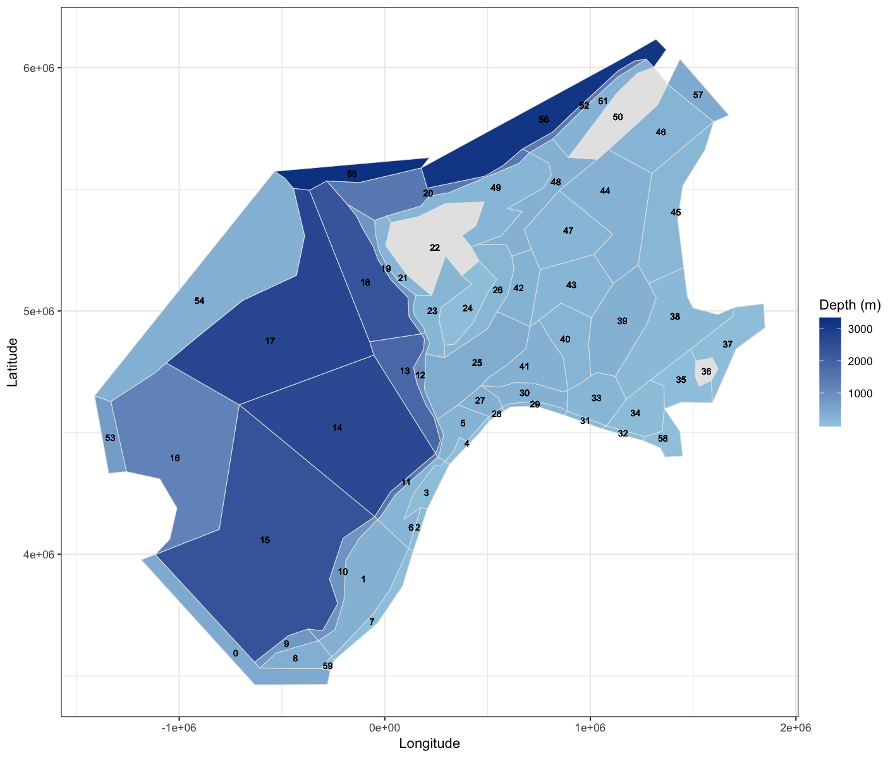

```{r setup, include=FALSE}
knitr::opts_chunk$set(echo = TRUE, message = FALSE, warning = FALSE)
library(here)
library(tidyverse)  
library(atlantisom)
library(ggthemes)

```

## Species surveyed

Our initial species selection includes 11 single species groups from the NOBA model. We looked at diet overlap [here](https://sgaichas.github.io/poseidon-dev/NOBAmsdiets.html). Below we will double check survey census outputs against the true values, and then test some survey specifications that may be reasonable for multispecies model testing. Finally we will apply survey functions to the detailed diet data.

```{r spp-table}

fgs <- load_fgs(here("atlantisoutput", "NOBA_March_2020"), "nordic_groups_v04.csv")

lname <- data.frame(Latin = c("*Hippoglossoides platessoides*",
                              "*Reinhardtius hippoglossoides*",
                              "*Scomber scombrus*",
                              "*Melongrammus aeglefinus*",
                              "*Pollachius virens*",
                              "*Sebastes mentella*",
                              "*Micromesistius poutassou*",
                              "*Clupea harengus*",
                              "*Gadus morhua*",
                              "*Boreogadus saida*",
                              "*Mallotus villosus*"),
                    Code = c("LRD", "GRH", "MAC", "HAD", "SAI", "RED", 
                             "BWH", "SSH", "NCO", "PCO", "CAP")
)

sppsubset <- merge(fgs, lname, all.y = TRUE)
spptable <- sppsubset %>% 
  arrange(Index) %>%
  select(Name, Long.Name, Latin)

knitr::kable(spptable, col.names = c("Model name", "Full name", "Latin name"))

```

## Generating the census dataset (October 2020)

Note that survey config files must now name the survey.

### Unchanging config files

`NOBA2config.R` looks like this (adjusted from Alfonso's original):

```{r, code = readLines("./config/NOBA2Config.R"), eval=F}
```

`omdimensions.R` standardizes timesteps, etc. (this is part of atlantisom and should not need to be changed by the user):

```{r, code = readLines("./config/omdimensions.R"), eval=F}
```

### Change these survey and fishery config files

`mssurvey_spring.R` and `mssurvey_fall.R` configure the fishery independent surveys (in this census test, surveys sample all model polygons in all years and have efficiency of 1 for all species, with no size selectivity):

```{r, code = readLines("./config/mssurvey_spring.R"), eval=F}
```

```{r, code = readLines("./config/mssurvey_fall.R"), eval=F}
```

`msfishery.R` configures the fishery dependent data:

```{r, code = readLines("./config/msfishery.R"), eval=F}
```

These survey and fishery configurations were used [previously](https://sgaichas.github.io/poseidon-dev/NOBAmsdiets.html) to generate saved census survey output.

### Read in previously generated survey and fishery outputs and plot them against true outputs

Using `read_savedsurvs()` we get back the same objects generated by the wrapper functions `om_index()` and `om_comps()`.

```{r test-readurvs}

source(here("config", "NOBA2config.R"))
omlist_ss <- readRDS(file.path(d.name, paste0(scenario.name, "omlist_ss.rds")))
source(here("config/omdimensions.R"))

# add this paste0(d.name, "/mscensus1") and add option to name save directory in wrappers
survObsBiom <- read_savedsurvs(paste0(d.name, "/mscensus1"), 'survB')
age_comp_data <- read_savedsurvs(paste0(d.name, "/mscensus1"), 'survAge')
len_comp_data <- read_savedsurvs(paste0(d.name, "/mscensus1"), 'survLen')
wtage <- read_savedsurvs(paste0(d.name, "/mscensus1"), 'survWtage')
annage_comp_data <- read_savedsurvs(paste0(d.name, "/mscensus1"), 'survAnnAge')
annage_wtage <- read_savedsurvs(paste0(d.name, "/mscensus1"), 'survAnnWtage')

# no function needed for saved fishery output as long as there is only one fishery specification file

catchbio_ss <- readRDS(file.path(paste0(d.name, "/mscensus1"), paste0(scenario.name, "fishCatch.rds")))
catchbio_ss <- catchbio_ss[[1]] #in same time unit as surveys

fish_age_comp <- readRDS(file.path(paste0(d.name, "/mscensus1"), paste0(scenario.name, "fishObsAgeComp.rds")))
fish_age_comp <- fish_age_comp[[1]]

#add this to om_indices function so that this has years when read in
#fish_age_comp$time <- fish_age_comp$time/fstepperyr

fish_len_comp_data <- readRDS(file.path(paste0(d.name, "/mscensus1"), paste0(scenario.name, "fishObsLenComp.rds")))

#len_comp_data <- len_comp_data[[1]]
fish_len_comp_data <- fish_len_comp_data[[1]]

#add this to om_indices function so that this has years when read in
#fish_len_comp_data$time <- as.integer(floor(fish_len_comp_data$time/fstepperyr))

fishwtage <- readRDS(file.path(paste0(d.name, "/mscensus1"), paste0(scenario.name, "fishObsWtAtAge.rds")))
fishwtage <- fishwtage[[1]] #need to change time units?

fish_annage_comp <- readRDS(file.path(paste0(d.name, "/mscensus1"), paste0(scenario.name, "fishObsFullAgeComp.rds")))
fish_annage_comp <- fish_annage_comp[[1]]

#add this to om_indices function so that this has years when read in
#fish_annage_comp$time <- fish_annage_comp$time/fstepperyr

fish_annage_wtage <- readRDS(file.path(paste0(d.name, "/mscensus1"), paste0(scenario.name, "fishObsFullWtAtAge.rds")))
fish_annage_wtage <- fish_annage_wtage[[1]] #need to change time units?

```

Crunch a few things to get true age comps and census length comp for later
```{r}
# age classes
totNagecl <- omlist_ss$truenums_ss %>%
  group_by(species, agecl, time) %>%
  summarize(numAtAge = sum(atoutput))

totN <- totNagecl %>%
  group_by(species, time) %>%
  summarize(totN = sum(numAtAge))

trueNagecl <- merge(totNagecl, totN)

# annual ages
totNage <- omlist_ss$truenumsage_ss %>%
  group_by(species, agecl, time) %>%
  summarize(numAtAge = sum(atoutput))

#this should be exactly the same as totN but just making sure...
totN2 <- totNage %>%
  group_by(species, time) %>%
  summarize(totN = sum(numAtAge))

trueNage <- merge(totNage, totN2)

# fishery catch at age class
totCagecl <- omlist_ss$truecatchnum_ss %>%
  group_by(species, agecl, time) %>%
  summarize(numAtAge = sum(atoutput))

totCAAcl <- totCagecl %>%
  group_by(species, time) %>%
  summarize(totN = sum(numAtAge))

trueCAAcl <- merge(totCagecl, totCAAcl)

# fishery catch at annual age
totCage <- omlist_ss$truecatchage_ss %>%
  group_by(species, agecl, time) %>%
  summarize(numAtAge = sum(atoutput))

totCAA <- totCage %>%
  group_by(species, time) %>%
  summarize(totN = sum(numAtAge))

trueCAA <- merge(totCage, totCAA)

# census length comps each survey
lf_census_prop <- list()
for(s in names(len_comp_data)){
  lcomp <- as.data.frame(len_comp_data[[s]][[1]])
  lf_census_tot <- aggregate(lcomp$atoutput,list(lcomp$species, lcomp$time),sum )
  names(lf_census_tot) <- c("species", "time","totlen")
  lf_census <- left_join(lcomp, lf_census_tot) %>%
    rename(censuslen = atoutput)
  lf_census_prop[[s]] <- lf_census
}
#lf_census_prop <- bind_rows(lf_census_prop) flatten, only works if surveys at different times

# fishery length comps (haven't changed here)


```


My plotting functions: too specialized to include in the package?

```{r plotfuns}

# plot biomass time series facet wrapped by species
plotB <- function(dat, truedat=NULL){
  
    ggplot() +
    geom_line(data=dat, aes(x=time/stepperyr,y=atoutput, color="Survey Biomass"), 
              alpha = 10/10) +
    {if(!is.null(truedat)) geom_line(data=truedat, aes(x=time/365,y=atoutput, color="True B"), alpha = 3/10)} + 
    theme_tufte() +
    theme(legend.position = "top") +
    xlab("model year") +
    ylab("tons") +
    labs(colour=scenario.name) +
    facet_wrap(~species, scales="free") 
  
}

# make a catch series function that can be split by fleet? this doesnt
# also note different time (days) from model timestep in all other output
plotC <- function(dat, truedat=NULL){
  
    ggplot() +
    geom_line(data=dat, aes(x=time/365,y=atoutput, color="Catch biomass"), 
              alpha = 10/10) +
    {if(!is.null(truedat)) geom_line(data=truedat, aes(x=time/365,y=atoutput, color="True Catch"), alpha = 3/10)} + 
    theme_tufte() +
    theme(legend.position = "top") +
    xlab("model year") +
    ylab("tons") +
    labs(colour=scenario.name) +
    facet_wrap(~species, scales="free") 
  
}

# note on ggplot default colors, can get the first and second using this
# library(scales)
# show_col(hue_pal()(2))

# plot length frequencies by timestep (one species)
plotlen <- function(dat, effN=1, truedat=NULL){
  
  cols <- c("Census Lcomp"="#00BFC4","Sample Lcomp"="#F8766D")  
  ggplot(mapping=aes(x=upper.bins)) +
    {if(is.null(truedat)) geom_bar(data=dat, aes(weight = atoutput/effN))} +
    {if(!is.null(truedat)) geom_bar(data=dat, aes(weight = censuslen/totlen, fill="Census Lcomp"), alpha = 5/10)} +
    {if(!is.null(truedat)) geom_bar(data=dat, aes(weight = atoutput/effN, fill="Sample Lcomp"), alpha = 5/10)} +
    theme_tufte() +
    theme(legend.position = "bottom") +
    xlab("length (cm)") +
    {if(is.null(truedat)) ylab("number")} +
    {if(!is.null(truedat)) ylab("proportion")} +
    scale_colour_manual(name="", values=cols) +
    labs(subtitle = paste(scenario.name,
                          dat$species)) +
    facet_wrap(~time, ncol=6, scales="free_y")

}

# plot numbers at age by timestep (one species)
Natageplot <- function(dat, effN=1, truedat=NULL){
  ggplot() +
    geom_point(data=dat, aes(x=agecl, y=atoutput/effN, color="Est Comp")) +
    {if(!is.null(truedat)) geom_line(data=dat, aes(x=agecl, y=numAtAge/totN, color="True Comp"))} + 
    theme_tufte() +
    theme(legend.position = "bottom") +    
    xlab("age/agecl") +
    {if(is.null(truedat)) ylab("number")} +
    {if(!is.null(truedat)) ylab("proportion")} +
    labs(subtitle = paste(scenario.name,
                          dat$species)) + 
    facet_wrap(~time, ncol=6, scales="free_y")
}

# plot weight at age time series facet wrapped by species
wageplot <- function(dat, truedat=NULL){
  ggplot(dat, aes(time/stepperyr, atoutput)) +
    geom_line(aes(colour = factor(agecl))) +
    theme_tufte() +
    theme(legend.position = "bottom") +
    xlab("model year") +
    ylab("average individual weight (g)") +
    labs(subtitle = paste0(scenario.name)) +
    facet_wrap(c("species"), scales="free_y")
}
  
# compare N at age and C at age between standard and ANNAGE outputs
totNageplot <- function(dat, anndat){
  
    ggplot() +
    geom_line(data=dat, aes(x=time/stepperyr,y=totN, color="Tot N cohorts"), 
              alpha = 5/10) +
    geom_line(data=anndat, aes(x=time/stepperyr,y=totN, color="Tot N annage"), alpha = 5/10) + 
    theme_tufte() +
    theme(legend.position = "top") +
    xlab("model year") +
    ylab("N") +
    labs(colour=scenario.name) +
    facet_wrap(~species, scales="free") 
  
}

```

### Visualize census surveys {.tabset #census}

We are using the full time series for biomass and weight at age, and a subsample of years 30-53 for compositions. In this test we see the effect of surveying in one season, with migratory species missed or only partially represented in some surveys, and with the overall surveyed biomass being at the lower or higher end of the range depending on the time of year. (Observation error is included in the survey biomass time series.) Samples for length and age assume a total of 100000 fish were randomly sampled for each species in each survey (surveffN defined in the survey config files). 

#### Survey biomass
```{r, results="asis"}

# compare with true output (all timesteps)
for(s in names(survObsBiom)){
  cat("  \n##### ",  s,"  \n")
  print(plotB(survObsBiom[[s]][[1]], omlist_ss$truetotbio_ss))
  cat("  \n")
}

# plots survey only
# for(s in names(survObsBiom)){
#   print(plotB(survObsBiom[[s]][[1]]))
# }

```

#### Survey length composition
```{r, results="asis"}

for(s in names(len_comp_data)){
  cat("  \n##### ",  s,"  \n")
  lcompsub <- as.data.frame(len_comp_data[[s]][[1]]) %>% filter(time %in% c(150:270)) %>%
    group_by(species) %>%
    group_map(~ plotlen(.x), keep = TRUE)
  
  for(i in 1:length(lcompsub)) {
    print(lcompsub[[i]])
  }
  cat("  \n")
}

```

#### Survey age class composition (Atlantis age class)
```{r, results="asis", message=FALSE, warning=FALSE}

for(s in names(age_comp_data)){
  cat("  \n##### ",  s,"  \n")
  acompsub <- as.data.frame(age_comp_data[[s]][[1]]) %>% filter(time %in% c(150:270)) %>%
    group_by(species) %>%
    left_join(., trueNagecl) %>%
    #group_map(~ Natageplot(.x), keep = TRUE) # plots only sampled age comp
    group_map(~ Natageplot(.x, effN = 100000, truedat = 1), keep = TRUE) # plots merged true age comp

  for(i in 1:length(acompsub)) {
    print(acompsub[[i]])
  }
  cat("  \n")
}

```

#### Survey age composition (annual ages)
```{r plot-annagecomp, results="asis", message=FALSE, warning=FALSE}

for(s in names(annage_comp_data)){
  cat("  \n##### ",  s,"  \n")
  acompsub <- as.data.frame(annage_comp_data[[s]][[1]]) %>% filter(time %in% c(150:270)) %>%
    group_by(species) %>%
    left_join(., trueNage) %>%
    #group_map(~ Natageplot(.x), keep = TRUE) # plots only sampled age comp
    group_map(~ Natageplot(.x, effN = 100000, truedat = 1), keep = TRUE) # plots merged true age comp
  
  for(i in 1:length(acompsub)) {
    print(acompsub[[i]])
  }
  cat("  \n")
}
```

#### Survey weight at age (Atlantis age class)
```{r, results='asis'}

for(s in names(wtage)){
  cat("  \n##### ",  s,"  \n")
  print(wageplot(wtage[[s]][[1]]))
  cat("  \n")
}

```

#### Survey iterpolated weight at age (annual ages) 
```{r plot-annwtage, fig.height=10, results='asis'}

# annage_wtage read in above 
# annage_wtage <- annage_wtage[[1]] #this still has second list component, diagnostic plot
# annage_wtage <- annage_wtage[[1]] #still in this old version but just removed from function.

for(s in names(annage_wtage)){
  cat("  \n##### ",  s,"  \n")
  print(wageplot(annage_wtage[[s]][[1]][[1]]))
  cat("  \n")
}
```

### {-}

### Visualize perfectly observed fisheries {.tabset}

We are using the full time series for total catch and weight at age, and a subsample of years 30-35 for compositions. Fishery length and age composition is sampled every output timestep. Fishery effN for length and age sampling was 1000 fish per year (200 per time step), so this is reflected in the composition plots.

#### Fishery total catch
```{r}

# compare with true catch, should match
plotC(catchbio_ss, omlist_ss$truecatchbio_ss)

```


#### Fishery length composition 
```{r}

lcompsub <- as.data.frame(fish_len_comp_data) %>% filter(time %in% c(150:175)) %>%
  group_by(species) %>%
  group_map(~ plotlen(.x), keep = TRUE)

for(i in 1:length(lcompsub)) {
  print(lcompsub[[i]])
}

```


#### Fishery catch at age (Atlantis age class)
```{r, message=FALSE, warning=FALSE}

acompsub <- as.data.frame(fish_age_comp) %>% filter(time %in% c(150:175)) %>%
  group_by(species) %>%
  left_join(., trueCAAcl) %>%
  #group_map(~ Natageplot(.x), keep = TRUE) # plots only sampled age comp
  group_map(~ Natageplot(.x, effN = 200, truedat = 1), keep = TRUE) # plots merged true age comp


for(i in 1:length(acompsub)) {
  print(acompsub[[i]])
}

```


#### Fishery catch at age (annual ages)
```{r, message=FALSE, warning=FALSE}

acompsub <- as.data.frame(fish_annage_comp) %>% filter(time %in% c(150:175)) %>%
  group_by(species) %>%
  left_join(., trueCAA) %>%
  #group_map(~ Natageplot(.x), keep = TRUE) # plots only sampled age comp
  group_map(~ Natageplot(.x, effN = 200, truedat = 1), keep = TRUE) # plots merged true age comp

for(i in 1:length(acompsub)) {
  print(acompsub[[i]])
}

```


#### Fishery weight at age (Atlantis age class)
```{r}

wageplot(fishwtage)

```


#### Fishery interpolated weight at age (annual ages)
```{r, fig.height=10}

#diagnostic plot component still in this old version but just removed from function.
wageplot(fish_annage_wtage[[1]])

```

### {-}

## Specifying a more realistic survey.

### New survey and fishery config files

`mssurvey_spring_01.R` and `mssurvey_fall_01.R` configure the fishery independent surveys. We keep spring and fall survey timing, but now we have efficiency defined for each species and a selectivity function for each species. Our surveys exclude offshore areas. These specifications are invented for demonstration purposes, not intended to realistically mimic a particular survey:

```{r, code = readLines("./config/mssurvey_spring_01.R"), eval=F}
```

```{r, code = readLines("./config/mssurvey_fall_01.R"), eval=F}
```

`msfishery_01.R` configures the fishery dependent data, which has a higher observation error on the total catch and does not get biological sampling from all areas:

```{r, code = readLines("./config/msfishery_01.R"), eval=F}
```

Model boxes show where our survey works now. We are including boxes 1:8, 21, 23:31, 33, 39:44, 47:49 in these surveys, and in fishery comps sampling:

```{r NOBAmap}

```

The way sampling is set up, effective N for each survey is the number of fish measured for length, age, and average weight at age. We could introduce further realism by using the `sample_ages()` function to take a subsample for age composition and optionally apply an ageing error matrix. This would require changing the `om_comps()` wrapper: see [atlantisom issue](https://github.com/r4atlantis/atlantisom/issues/42).  

### New survey and fishery outputs

```{r full-test, message=FALSE, warning=FALSE, eval=FALSE}

#NOBAom <- om_init(here("config/NOBA2config.R"))

#NOBAom_ms <- om_species(sppsubset$Name, NOBAom)

NOBAom_ms <- readRDS(file.path(d.name, paste0(scenario.name, "omlist_ss.rds")))

# new wrapper for multiple surveys saves survey output separately
# but returns a list with all surveys, not ideal; make consistent

NOBAom_ms_ind <- om_index(usersurvey = c(here("config/mssurvey_spring_01.R"), 
                                         here("config/mssurvey_fall_01.R")), 
                           userfishery = here("config/msfishery_01.R"),
                           omlist_ss = NOBAom_ms, 
                           n_reps = 1, 
                           save = TRUE)

NOBAom_ms_comp <- om_comps(usersurvey = c(here("config/mssurvey_spring_01.R"), 
                                         here("config/mssurvey_fall_01.R")), 
                           userfishery = here("config/msfishery_01.R"),
                           omlist_ss = NOBAom_ms, 
                           n_reps = 1, 
                           save = TRUE)


```

NOTE! Need to have selectivities defined *both* for annual ages and for age classes. Worked in census because flat selectivity was defined for full set of annual ages and it just didn't use past age 10 for age class output. They were all 1 anyway so it didnt matter. The updated survey config file first specifies selectivity by true age and then backs out an approximate equivalent for age classes. We will use true age classes for the real datasets but wanted to check both outputs here. `om_comps()` has now changed to take `survselex.agecl` as input to the age class comps and survselex as input to the full comps. 

Both `om_index()` and `om_comps()` wrappers now name fishery output based on a `fishery.name` in the fishery config file.

```{r read-newsurvs, message=FALSE, warning=FALSE}

# source(here("config", "NOBA2config.R"))
# omlist_ss <- readRDS(file.path(d.name, paste0(scenario.name, "omlist_ss.rds")))
# source(here("config/omdimensions.R"))

source(here("config/mssurvey_spring_01.R"))
source(here("config/msfishery_01.R"))

# add this paste0(d.name, "/mscensus1") and add option to name save directory in wrappers
survObsBiom <- read_savedsurvs(d.name, 'survB')
age_comp_data <- read_savedsurvs(d.name, 'survAge')
len_comp_data <- read_savedsurvs(d.name, 'survLen')
wtage <- read_savedsurvs(d.name, 'survWtage')
annage_comp_data <- read_savedsurvs(d.name, 'survAnnAge')
annage_wtage <- read_savedsurvs(d.name, 'survAnnWtage')

# no function needed for saved fishery output as long as there is only one fishery specification file

catchbio_ss <- readRDS(file.path(d.name, paste0(scenario.name, "_",
                                                     fishery.name, "fishCatch.rds")))
catchbio_ss <- catchbio_ss[[1]] #in same time unit as surveys

fish_age_comp <- readRDS(file.path(d.name, paste0(scenario.name, "_",
                                                     fishery.name, "fishObsAgeComp.rds")))
fish_age_comp <- fish_age_comp[[1]]

#add this to om_indices function so that this has years when read in
#fish_age_comp$time <- fish_age_comp$time/fstepperyr

fish_len_comp_data <- readRDS(file.path(d.name, paste0(scenario.name, "_",
                                                     fishery.name, "fishObsLenComp.rds")))

#len_comp_data <- len_comp_data[[1]]
fish_len_comp_data <- fish_len_comp_data[[1]]

#add this to om_indices function so that this has years when read in
#fish_len_comp_data$time <- as.integer(floor(fish_len_comp_data$time/fstepperyr))

fishwtage <- readRDS(file.path(d.name, paste0(scenario.name, "_",
                                                     fishery.name, "fishObsWtAtAge.rds")))
fishwtage <- fishwtage[[1]] #need to change time units?

fish_annage_comp <- readRDS(file.path(d.name, paste0(scenario.name, "_",
                                                     fishery.name, "fishObsFullAgeComp.rds")))
fish_annage_comp <- fish_annage_comp[[1]]

#add this to om_indices function so that this has years when read in
#fish_annage_comp$time <- fish_annage_comp$time/fstepperyr

fish_annage_wtage <- readRDS(file.path(d.name, paste0(scenario.name, "_",
                                                     fishery.name, "fishObsFullWtAtAge.rds")))
fish_annage_wtage <- fish_annage_wtage[[1]] #need to change time units?

```

### Visualize surveys with different q and selectivity {.tabset #survey}

We are using the full time series for biomass and weight at age, and a subsample of years 30-53 for compositions. In this test we see the effect of survey efficiency and selectivity as well as the effect of surveying in one season. (Observation error that differs by species group is included in the survey biomass time series.) Samples for length and age assume a total of 10000 fish were randomly sampled for each species in each survey (surveffN defined in the survey config files). 

#### Survey biomass
```{r, results="asis"}

# compare with true output (all timesteps)
for(s in names(survObsBiom)){
  cat("  \n##### ",  s,"  \n")
  print(plotB(survObsBiom[[s]][[1]], omlist_ss$truetotbio_ss))
  cat("  \n")
}

# plots survey only
# for(s in names(survObsBiom)){
#   print(plotB(survObsBiom[[s]][[1]]))
# }

```

#### Survey length composition
```{r, results="asis", message=FALSE}

for(s in names(len_comp_data)){
  cat("  \n##### ",  s,"  \n")
  lcompsub <- as.data.frame(len_comp_data[[s]][[1]]) %>% filter(time %in% c(150:270)) %>%
    group_by(species) %>%
    left_join(., lf_census_prop[[which(names(len_comp_data) == s)]]) %>%
    #group_map(~ plotlen(.x), keep = TRUE)
    group_map(~ plotlen(.x, effN = 10000, truedat = 1), keep = TRUE) # plots merged true length comp
 
  for(i in 1:length(lcompsub)) {
    print(lcompsub[[i]])
  }
  cat("  \n")
}

```

#### Survey age class composition (Atlantis age class)
```{r, results="asis", message=FALSE, warning=FALSE}

for(s in names(age_comp_data)){
  cat("  \n##### ",  s,"  \n")
  acompsub <- as.data.frame(age_comp_data[[s]][[1]]) %>% filter(time %in% c(150:270)) %>%
    group_by(species) %>%
    left_join(., trueNagecl) %>%
    #group_map(~ Natageplot(.x), keep = TRUE) # plots only sampled age comp
    group_map(~ Natageplot(.x, effN = 10000, truedat = 1), keep = TRUE) # plots merged true age comp

  for(i in 1:length(acompsub)) {
    print(acompsub[[i]])
  }
  cat("  \n")
}

```

#### Survey age composition (annual ages)
```{r plot-annagecomp-2, results="asis", message=FALSE, warning=FALSE}

for(s in names(annage_comp_data)){
  cat("  \n##### ",  s,"  \n")
  acompsub <- as.data.frame(annage_comp_data[[s]][[1]]) %>% filter(time %in% c(150:270)) %>%
    group_by(species) %>%
    left_join(., trueNage) %>%
    #group_map(~ Natageplot(.x), keep = TRUE) # plots only sampled age comp
    group_map(~ Natageplot(.x, effN = 10000, truedat = 1), keep = TRUE) # plots merged true age comp
  
  for(i in 1:length(acompsub)) {
    print(acompsub[[i]])
  }
  cat("  \n")
}
```

#### Survey weight at age (Atlantis age class)
```{r, results='asis'}

for(s in names(wtage)){
  cat("  \n##### ",  s,"  \n")
  print(wageplot(wtage[[s]][[1]]))
  cat("  \n")
}

```

#### Survey iterpolated weight at age (annual ages) 
```{r plot-annwtage-2, fig.height=10, results='asis'}

# annage_wtage read in above 
# annage_wtage <- annage_wtage[[1]] #this still has second list component, diagnostic plot
# annage_wtage <- annage_wtage[[1]] #still in this old version but just removed from function.

for(s in names(annage_wtage)){
  cat("  \n##### ",  s,"  \n")
  print(wageplot(annage_wtage[[s]][[1]]))
  cat("  \n")
}
```

### {-}

### Visualize fisheries observed with some error {.tabset}

Here we are not sampling all fished areas, and the observation error on the total catch index is higher. We are using the full time series for total catch and weight at age, and a subsample of years 30-35 for compositions. Fishery length and age composition is sampled every output timestep. Fishery effN for length and age sampling was 1000 fish per year (200 per time step), so this is reflected in the composition plots.

#### Fishery total catch
```{r}

# compare with true catch, should match
plotC(catchbio_ss, omlist_ss$truecatchbio_ss)

```


#### Fishery length composition 
```{r}

lcompsub <- as.data.frame(fish_len_comp_data) %>% filter(time %in% c(150:175)) %>%
  group_by(species) %>%
  group_map(~ plotlen(.x), keep = TRUE)

for(i in 1:length(lcompsub)) {
  print(lcompsub[[i]])
}

```


#### Fishery catch at age (Atlantis age class)
```{r, message=FALSE, warning=FALSE}

acompsub <- as.data.frame(fish_age_comp) %>% filter(time %in% c(150:175)) %>%
  group_by(species) %>%
  left_join(., trueCAAcl) %>%
  #group_map(~ Natageplot(.x), keep = TRUE) # plots only sampled age comp
  group_map(~ Natageplot(.x, effN = 200, truedat = 1), keep = TRUE) # plots merged true age comp


for(i in 1:length(acompsub)) {
  print(acompsub[[i]])
}

```


#### Fishery catch at age (annual ages)
```{r, message=FALSE, warning=FALSE}

acompsub <- as.data.frame(fish_annage_comp) %>% filter(time %in% c(150:175)) %>%
  group_by(species) %>%
  left_join(., trueCAA) %>%
  #group_map(~ Natageplot(.x), keep = TRUE) # plots only sampled age comp
  group_map(~ Natageplot(.x, effN = 200, truedat = 1), keep = TRUE) # plots merged true age comp

for(i in 1:length(acompsub)) {
  print(acompsub[[i]])
}

```


#### Fishery weight at age (Atlantis age class)
```{r}

wageplot(fishwtage)

```


#### Fishery interpolated weight at age (annual ages)
```{r, fig.height=10}

#diagnostic plot component still in this old version but just removed from function.
wageplot(fish_annage_wtage)

```

### {-}
